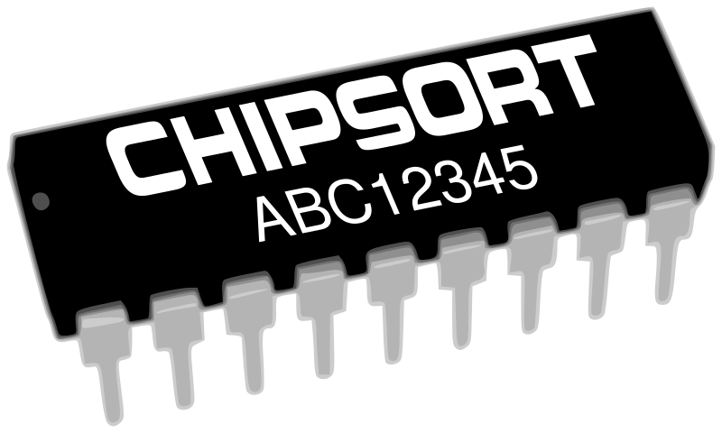

# ChipSort.jl

<p align="center">
  
</p>

ChipSort is a sorting module containing SIMD and cache-aware techniques. It's based on a couple of [academic papers](#references) from 2008.

## Introduction

Processing power in computers has been growing faster than memory bandwidth for years. To reach high performance, some of the main priorities for a programmer today should be:
- Exploit thread parallelism
- Exploit SIMD parallelism
- Exploit cache memory
- Access memory as little and sequentially as possible

Algorithms like Quicksort dominated sorting benchmarks for years, but they tend to result in too frequent and unordered accesses to main memory. This means merge-sort, which was suitable for linear media like punched cards and magnetic tapes, became hip again. The strategy used in ChipSort takes this and other facts into account.


## Installation and usage

Like any experimental Julia package on GitHub you can install ChipSort by entering the package management shell typing `]`, and then

```
(v1.2) pkg> add https://github.com/nlw0/ChipSort.jl
```

You can now try out the basic functions offered by the package such as `sort_net()` to use a sorting network, or the initial sorting prototype implementation `chipsort()`.

```
julia> using ChipSort

julia> using SIMD

julia> data = [Vec(tuple(rand(Int8, 4)...)) for _ in 1:4]
4-element Array{Vec{4,Int8},1}:
 <4 x Int8>[-15, 98, 5, -28]
 <4 x Int8>[47, -112, 98, -14]
 <4 x Int8>[-18, -3, -111, 85]
 <4 x Int8>[79, -12, -44, -85]

julia> x = sort_net(data...)
(<4 x Int8>[-18, -112, -111, -85], <4 x Int8>[-15, -12, -44, -28], <4 x Int8>[47, -3, 5, -14], <4 x Int8>[79, 98, 98, 85])

julia> y = transpose_vecs(x...)
(<4 x Int8>[-18, -15, 47, 79], <4 x Int8>[-112, -12, -3, 98], <4 x Int8>[-111, -44, 5, 98], <4 x Int8>[-85, -28, -14, 85])

julia> z = merge_vecs(y...)
<16 x Int8>[-112, -111, -85, -44, -28, -18, -15, -14, -12, -3, 5, 47, 79, 85, 98, 98]

julia> bigdata = rand(Int16, 256);

julia> chipsort(bigdata, Val(8), Val(8), Val(8)) == sort(bigdata)
true
```


## Methods

For small arrays, our strategy is to use non-branching and SIMD-friendly [sorting](http://www.cs.brandeis.edu/~hugues/sorting_networks.html) and [bitonic merge](https://en.wikipedia.org/wiki/Bitonic_sorter) networks. This is pretty much the best approach in this case, and even practical Quicksort implementations use something like this for small arrays. In this situation we try our best to load all the input data into the processor registers, and do as much as we can there before putting any data back into memory. In other words, we sort small sequences _in the chip_.

For larger arrays, ChipSort employs two stages. The first stage utilizes the same methods for small arrays to create an initial set of ordered sequences. They're made as big as it fits inside register memory before we have to start moving (too much) stuff back to the stack to carry out the calculations. A modern processor core can already offer kilobytes of register memory.

The second stage is to perform a multi-way merge of all these small sequences. They are all processed at the same time, split in small buffers which are input to the bitonic merge network. This procedure requires a binary tree to keep intermediate merged sub-sequences. This structure should fit in the cache memory.

With just two passes over the whole data in the RAM this approach can already handle thousands of entries. If the input array is so large that the merge tree is too big for the cache, then we perform more multi-way merge stages with an increasingly large chunk size.

To find out more about the performance gains ChipSort can provide, check our [benchmark](doc/benchmark.md) documentation page. Note that this project is still young, and a lot of work is necessary to offer a reliable sort guaranteed to be as good as e.g. the one offered by the Julia standard library. Our first priority is to be a laboratory for implementing generic SIMD-based sorting techniques in Julia.

## Implementation

One interesting aspect from the ChipSort implementation is the extensive use of meta-programming. Our implementation of the sorting network, bitonic merge network and matrix transpose are all based on generated functions.

This module relies on SIMD.jl whenever necessary. In special, the transpose and bitonic merge use the `shufflevector` function. The sorting network uses the `min` and `max` functions, which the `Vec` class supports.

Another notable implementation aspect is the use of non-temporal memory access, which prevents cache pollution and also improves writing throughput.

## References

### Scientific publications
- [_Efficient Implementation of Sorting on Multi-Core SIMD CPU Architecture_](http://www.vldb.org/pvldb/1/1454171.pdf), Jatin Chhugani et al. (2008)
- [_SIMD- and Cache-Friendly Algorithm for Sorting an Array of Structures_](http://www.vldb.org/pvldb/vol8/p1274-inoue.pdf), Hiroshi Inoue and Kenjiro Taura (2007)

### Related packages

- https://github.com/eschnett/SIMD.jl
- https://github.com/JeffreySarnoff/SortingNetworks.jl
- https://github.com/JuliaCollections/SortingAlgorithms.jl
- https://github.com/xiaodaigh/SortingLab.jl
